# Topo-Carving

**Discovering surface topology from multi-view silhouettes — with guaranteed-manifold operators.**

Most differentiable mesh reconstruction assumes the topology (a template with the right number of
holes) and only preserves it. **Topo-Carving discovers the genus from the images**: a space-carving
oracle tells the optimizer *how many* tunnels the shape has and *where* they are, and every topology
change is executed as a TopMod **DLFL `add_handle`** — so the mesh is a valid orientable 2-manifold,
watertight, after **every** step, and the genus can never drift silently.

**Status summary (2026-10-08, golden v7.1): [`STATUS.md`](STATUS.md)** — capability matrix, measured head-to-head with Nicolet / Palfinger / DMesh / DMesh++ / Gu et al., Thingi10K coverage, where we are behind and what closes each gap.

## The whole algorithm in one strip

<p align="center">

</p>

<p align="center">
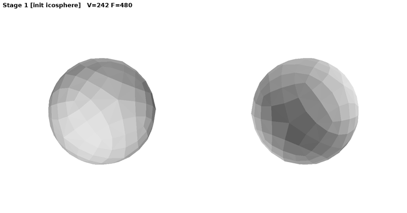 4"/>
<br/><i>Live: fertility from a genus-0 icosphere to the correct genus-4 statue. The title bar tracks
the stage and the genus — watch <code>add_handle</code> open each tunnel.</i>
</p>

## What's new in v7 (2026-10-07): thin walls

<p align="center">
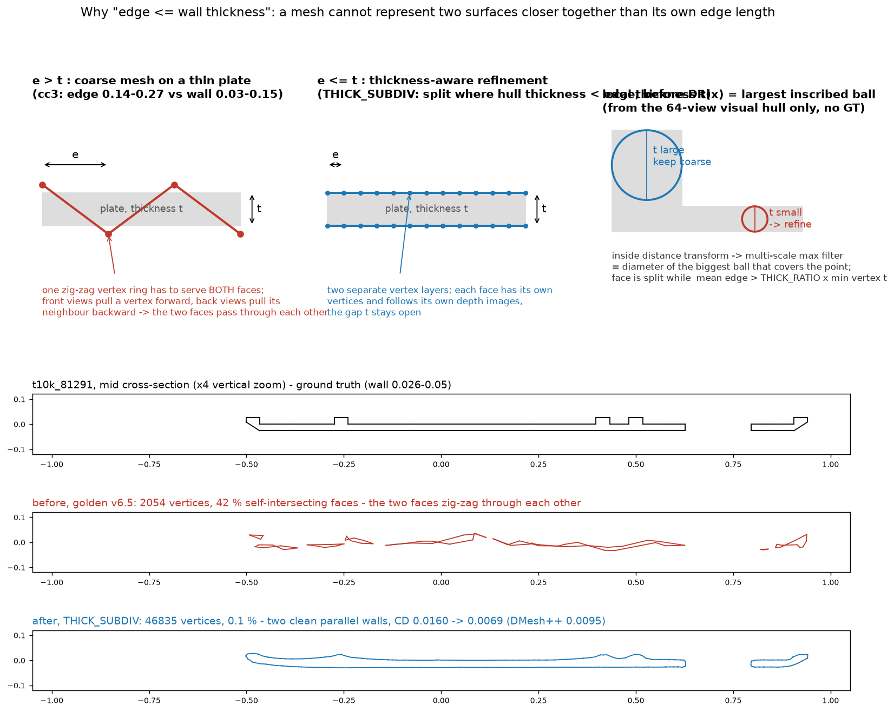
<br/><i>Top: a mesh cannot represent two surfaces closer together than its own edge length — on a thin plate the
coarse icosphere's front and back pass through each other during DR. Bottom: Thingi10K 81291, mid cross-section,
ground truth / golden v6.5 (two faces zig-zagging through each other, 42 % self-intersecting faces) / v7 (two clean
walls, Chamfer 0.0160 → 0.0069; DMesh++ 0.0095).</i>
</p>

> **Status (golden v7.1, tag `golden-v7.1`).** v6.5 returned the right genus on thin-walled objects but on a
> *wreck*: at the coarse stage the mesh edge (0.14–0.27) is 2–8× the wall (0.03–0.15), the two sides of every plate
> interpenetrate and nothing downstream recovers (42–77 % self-intersecting faces, Chamfer 2–7× DMesh++). v7 fixes the
> cause instead of the symptom.

- **Thickness-aware coarse subdivision** ([`thick_subdiv.py`](experiments/opseq_v5/despike/thick_subdiv.py), `THICK_SUBDIV=1`, default).
  Local wall thickness is read off the 64-view visual hull alone (inside distance transform → multi-scale max filter =
  diameter of the largest inscribed ball, no GT). After the cc3 DR, every face whose mean edge exceeds the local
  thickness is DLFL-subdivided (`subdivide_edge` + `stellate`, 1-ring expanded; ≤ 2 rounds, 30k-vertex budget, thinnest
  faces first) **before** the sides can cross, then settled. A plate refines everywhere (962 → 33k vertices), a mixed
  part only where it is thin (962 → 15k). Stage 4 then equalises the remaining coarse faces instead of a global
  Catmull-Clark round.
- **Result on the four Thingi10K thin-wall wrecks** (same Chamfer as the DMesh++ table):
  81291 **5/5**, CD 0.0160 → **0.0069** (DMesh++ 0.0095); 113858 **9/9**, 0.0288 → **0.0059** (0.0062);
  1417963 **11/11**, 0.0504 → 0.0084 (0.0071); 236142 2/4, 0.0380 → **0.0177** (0.0357). All four pass the health check
  (self-intersections 0.1–4.4 %, silhouette fit 0.976–0.988); DMesh++ outputs are never closed (0/37).
- **Reference shapes unchanged or better** (armadillo, kitten, rocker-arm, threeholes, fertility ×3, botijo: genus
  and strict audit 9/9 runs; rocker-arm volume IoU 0.987 → 0.993, threeholes CD 0.00707 → 0.00686). Cost: 2–3× wall
  time (the refined coarse mesh flows through every stage).
- **Two audit/gate bugs the thin walls exposed** (v7.1): a hull air loop that *pierces* the surface (a sealed
  thin-wall tunnel) is not in the complement — its linking numbers inflated the rank above the genus and made the
  correct late drill impossible (113858); and the late-pass gate demanded "exactly +1 tunnel realised" while one drill
  through a thin wall legitimately unseals two (1417963: a drill that took the held-out IoU from 0.914 to 0.989 was
  rejected). Pierced loops now count as unrealised; the gate accepts any positive gain. Strict regression 7/7
  unchanged.
- **Three engineering fixes the larger meshes forced**: sparse 2-ring + chunked `cdist` in the tube mask (dense
  V×V needed 88 GB at 138k vertices); despike surgery on a local submesh instead of rebuilding the whole DLFL mesh per
  attempt (1.5 s → 0.017 s, identical results; Stage 4 was 81 min); the chain now aborts when a stage produces no
  output instead of falling through on stale files.
- **Known limit that remains** (236142): a post standing 0.07 off a plate in a concave corner — the hull is 2.6× the
  object there, our DR merges post and plate, the air loop passes outside the material and no detector fires. Needs
  depth-driven carving; see [`LESSONS` 7l](experiments/opseq_v5/despike/LESSONS_2026-09-29_site_check.md).

## Highlights (golden v6.5)

> **Status (2026-10-03, golden v6.5): strict surface topology.** Genus is only a count. v6.5 checks that the
> mesh surface *realises every tunnel of the carved hull*: a GT-free audit computes linking numbers between the
> mesh's handle loops and closed curves through the hull's tunnels
> ([`linking_audit.py`](experiments/opseq_v5/despike/linking_audit.py)). Under this audit v6.4 had the right
> genus in every run but on fertility only 6/21 runs had the right surface (one tunnel was open only through
> interpenetrating parts, the fourth handle was a hidden micro-handle). v6.2/v6.3 results are withdrawn
> (bridge bug); v6.4 numbers are genus-count statements.

- **Strict topology, five shapes**: fertility (genus 4), threeholes (3), kitten (1), rockerarm (1), armadillo (0):
  **15/15 runs** with the right genus *and* every hull tunnel realised by a surface handle; fertility alone
  16/16 with the final rules (v6.4: 6/21). See
  [`GOLDEN.md`](experiments/opseq_v5/despike/results64v/GOLDEN.md) v6.5.
- **How**: handles that realise no tunnel (micro-handles) are removed on the refined mesh; missing ones are added
  by a 2-second near-pair detector and accepted only if the number of realised tunnels goes up by exactly one;
  the mesh is re-audited after the final refine.
- **No time tail**: 4-9 min per chain on an RTX 5090 (v6.4: median 5.5 min on fertility, worst case 25 min).
- **Count-first propose-and-verify** and **hull-guided completion** still drive the coarse discovery stage.
- **Botijo (genus 5)**, a model used by competing work: genus discovered, 5/5 tunnels realised, volume IoU
  **0.996-0.998**, same parameters as every other shape.
- **Every topology change is a DLFL operator**: `add_handle` to open or join, the new `remove_handle` (its exact
  inverse, built from `delete_edge` + `stellate`) to delete a handle that realises no tunnel.
- **Knows when it does not apply**: an oracle check refuses shapes whose hull topology does not settle (thin-walled
  heptoroid) instead of returning a broken mesh.
- Held-out silhouette IoU **0.9972** on armadillo (DMesh plateaus at 0.989), volume IoU **0.992** on fertility.

## What `add_handle` actually does

TopMod's `add_handle(f1, f2)` deletes two faces and stitches their boundary loops together with a ring
of new side quads — a tube. Applied to the two pages of a thin membrane, it **drills a through-hole**:

<p align="center">

</p>

A donut whose hole is covered by a thin membrane is genus 0 (panels 1–2). `add_handle` on the
membrane's top face (red) and bottom face (blue) deletes both and joins their rims with 20 side quads
(orange, panel 4) — the tube wall; inside the tube is air, so the genus becomes 1 (panel 3). In the
pipeline, DLFL collapses then absorb the leftover membrane and the hole grows to the real tunnel
(panel 5). Real TopMod output, reproducible with
[`demo_add_handle_donut.py`](experiments/opseq_v5/despike/demo_add_handle_donut.py).
If the two faces had **air** between them instead of membrane material, the same operator would build
a *bridge* instead of drilling a hole — still genus +1, but a wrong tunnel. Keeping `add_handle` fed
with genuine membranes is exactly what the propose-and-verify gate is for.

## How it works

<p align="center">

</p>

**1 — Carve the oracle.** A voting visual hull is carved from the input silhouettes once. Its Euler
number gives the tunnel **count** g\* (morphological closing ladder, mode over radii); a
closing-ladder plug analysis gives each tunnel's **location** on demand.

**2 — See the membranes.** Faces whose interior samples sit in hull *air* are membranes blocking a
tunnel — the orange patches below are literally what the detector proposes to open:

<p align="center">

</p>

**3 — Propose-and-verify every handle.** Each membrane pair becomes a DLFL `add_handle` (manifold by
construction), kept only if a count-first gate and a differentiable-render check agree. The loop
stops exactly at g\*. When the refined mesh hugs the hull and membranes vanish, the oracle's plug
locations take over (hull-guided completion).

**4 — TopMod operators run the whole pipeline, not just the topology step.** `add_handle` is the
only *genus-changing* operator; everything else is topology-preserving TopMod machinery:

| stage | TopMod operators at work |
|---|---|
| init | `make_icosahedron`, `catmull_clark` (coarse-to-fine levels) |
| carve to hull (DR loop) | `flip`, `collapse_edge_tri` (link-condition guarded) |
| genus discovery | `insert_edge`/`delete_edge` (merge a membrane into one rim polygon), `subdivide_edge` (rim alignment), **`add_handle`** (genus +1, DR-verified) |
| refine | `catmull_clark`, `subdivide_edge`, `collapse_edge_tri`, `flip` — driven by a Palfinger-style adaptive schedule, executed as DLFL ops |
| strict repair + late pass | **`remove_handle`** (`delete_edge` on the band's spokes + `stellate`; genus −1), **`add_handle`** for joins (genus +1, rank-verified) |
| final | Taubin smoothing (vertex positions only — topology untouched) |

Because every one of these preserves the DLFL invariants, the mesh is manifold + watertight after
**every** step, and the genus can only change at a verified `add_handle` — robustness **by
construction**, not by a regularizer.

**5 — Audit the topology, not just the genus.** A mesh can have the right genus and still be wrong: one tunnel
open only because two parts interpenetrate, plus a hidden triangle-sized handle that makes up the count. The audit
builds one closed curve through each tunnel of the carved hull (left, middle) and computes the linking number of
every handle loop of the mesh with every such curve (right). The rank of that matrix is the number of tunnels the
surface really has. No ground truth involved.

<p align="center">
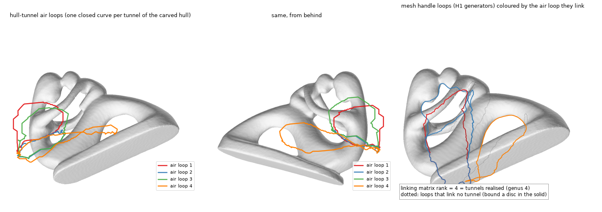
</p>

Under this audit the previous version (v6.4) had the right genus in 27/27 runs but the right surface in only 6/21
on fertility. v6.5 repairs it on the refined mesh: handles that link no tunnel are removed with `remove_handle`,
missing ones are added where two sheets meet and kept only if the rank goes up by exactly one; the mesh is audited
again after the last refinement.

Full description — every stage, rule, parameter, file and known problem:
**[`ALGORITHM.md`](experiments/opseq_v5/despike/ALGORITHM.md)**.

## Results — genus discovered, never assumed

| shape | genus | genus right | all tunnels realised | volume IoU | time (RTX 5090) |
|---|---|---|---|---|---|
| armadillo | 0 | 6/6 | 6/6 | 0.995 | 4.1–4.8 min |
| kitten | 1 | 6/6 | 6/6 | 0.998 | 4.3–5.0 min |
| rockerarm | 1 | 6/6 | 6/6 | 0.987 | 4.3–5.7 min |
| threeholes | 3 | 6/6 | 6/6 | 0.991 | 5.2–5.7 min |
| fertility | 4 | 16/16 | 16/16 | 0.988–0.992 | 5.6–8.7 min |
| botijo | 5 | 3/3 | 3/3 | 0.996–0.998 | 7.7–9.6 min |
| heptoroid | 22 | refused by the oracle check | — | — | — |

Thin-walled Thingi10K models (v7.1; Chamfer with [`compare_dmesh2.py`](experiments/opseq_v5/despike/compare_dmesh2.py), DMesh++ run with
the official code on the same 64 views):

| model | wall (p5 / p50) | genus | tunnels realised | self-int. | fit | CD v6.5 → v7.1 | CD DMesh++ |
|---|---|---|---|---|---|---|---|
| t10k_81291 (plate) | 0.026 / 0.035 | 5/5 | 5/5 | 0.1 % | 0.977 | 0.0160 → **0.0069** | 0.0095 |
| t10k_113858 | 0.076 / 0.103 | 9/9 | 9/9 | 0.0 % | 0.988 | 0.0288 → **0.0059** | 0.0062 |
| t10k_1417963 | 0.145 / 0.193 | 11/11 | 11/11 | 0.8 % | 0.987 | 0.0504 → 0.0084 | **0.0071** |
| t10k_236142 | 0.010 / 0.123 | 2/4 | 2/4 | 4.4 % | 0.981 | 0.0380 → **0.0177** | 0.0357 |

On the full 31-model Thingi10K set (v6.5 numbers; the v7.1 batch is running) DMesh++ wins Chamfer 22:9 with a
median of 0.0095 vs 0.0135 — and returns 0/31 closed meshes against our 31/31. On our six reference shapes we win
6:0 (0.0058–0.0071 vs 0.0062–0.0089).

<p align="center">
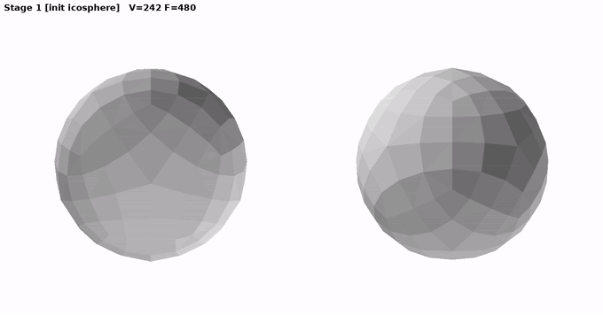 5"/>
<br/><i>Botijo from a sphere to genus 5: three tunnels drilled at the coarse stage, two joins on the refined mesh.</i>
</p>

<p align="center">
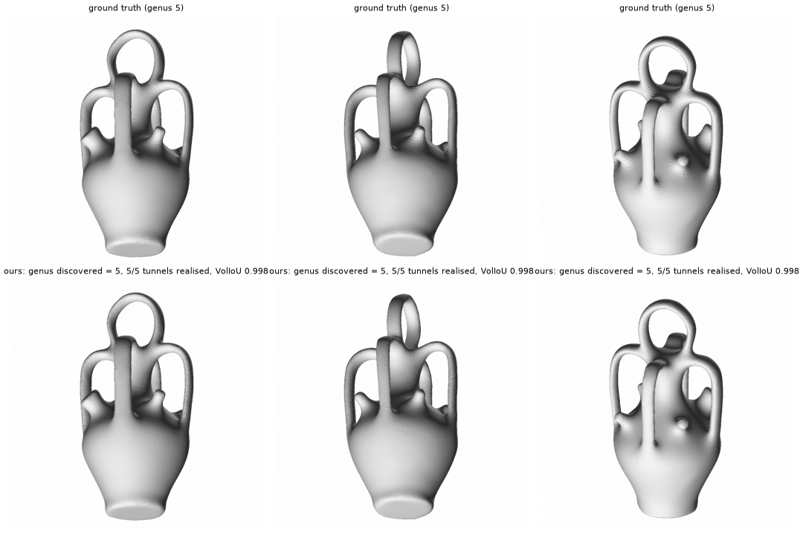
<br/><i>Botijo: ground truth (top) and our reconstruction (bottom). Three tunnels are drilled at the coarse stage,
the two where the handles press against the body are joined on the refined mesh.</i>
</p>


| | |
|:--:|:--:|
| 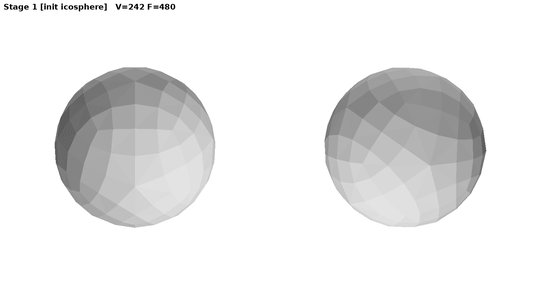 | 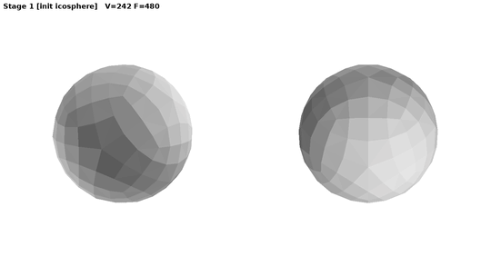 |
| threeholes — discovered genus **3** | kitten — discovered genus **1** |
| 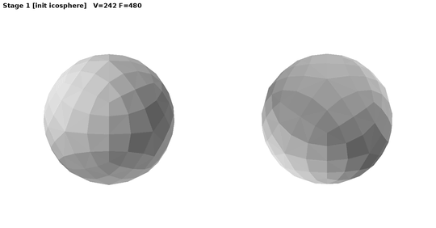 | 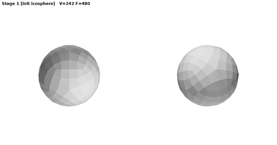 |
| rockerarm — discovered genus **1** | armadillo — discovered genus **0** (no false tunnels) |

1080p MP4 versions of all five runs:
[`results_genus/gifs/*_evolution_hd.mp4`](experiments/opseq_v5/despike/results_genus/gifs/).
**All recorded series** (the 64-camera mosaics of the v3/v5 chain before genus discovery, the v6.3 hero-view cuts, the final cut):
[`results_genus/gifs/GALLERY.md`](experiments/opseq_v5/despike/results_genus/gifs/GALLERY.md).

## Where it does not work

<p align="center">
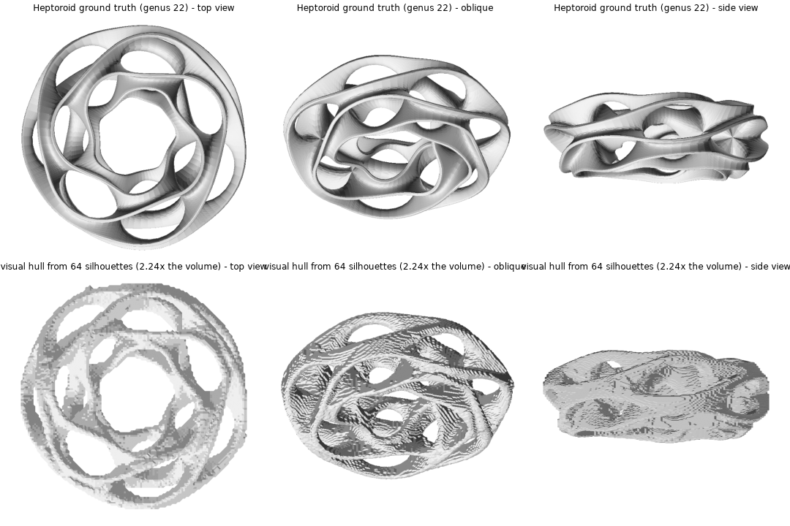
<br/><i>Heptoroid (genus 22): a thin saddle surface. Top: ground truth. Bottom: the visual hull from 64 silhouettes.</i>
</p>

The method reads topology off a hull carved from silhouettes. A thin curved wall hides its concave side from every
view, so the hull fills it: on heptoroid the hull has 1.9x the object's volume and a genus that does not settle
(40 / 31 / 44 for three closing radii; the truth is 22). More voxels do not help (256³ → 512³: no change); sharper
silhouette edges and 1-vote carving bring the excess down to 1.26x, not to a usable oracle; giving the true genus
does not help either, because the locations come from the hull. The oracle check detects this from the silhouettes
alone and refuses the shape. <p align="center">
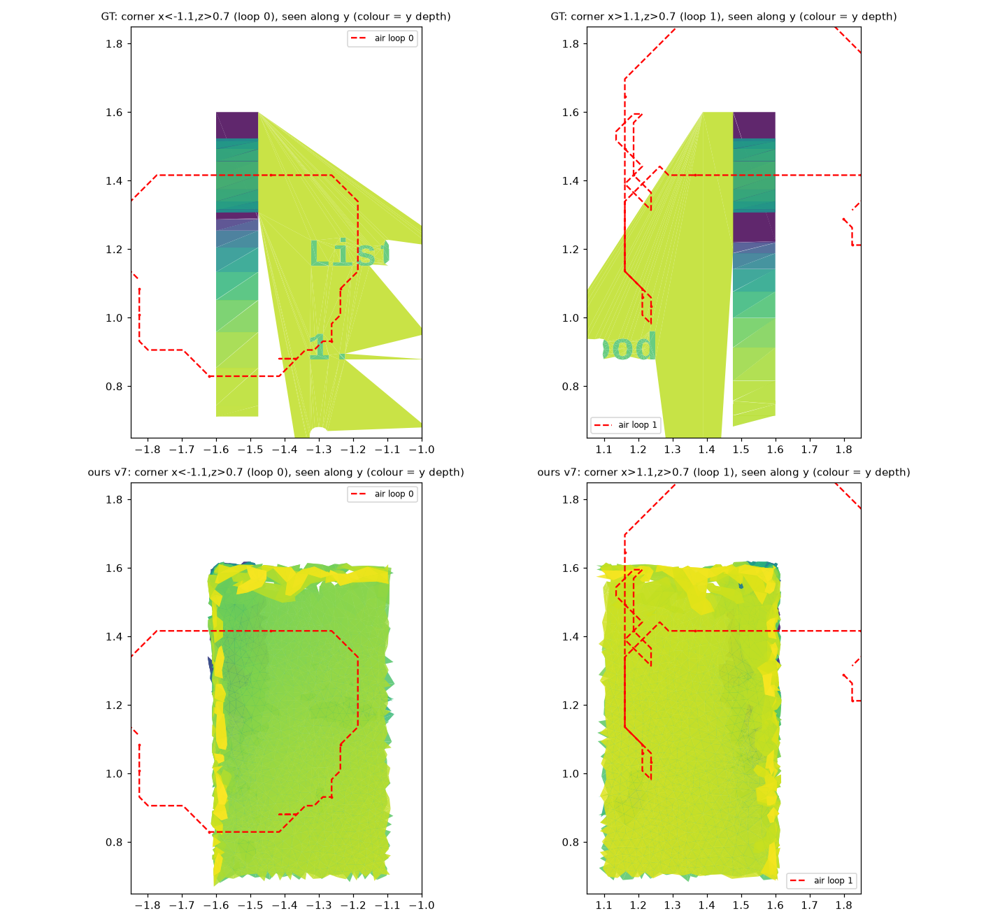
<br/><i>The remaining thin-wall failure (Thingi10K 236142, seen along the hole axis, colour = depth): a post standing
0.07 off the plate forms the tunnel (red: hull air loop). Our DR merges post and plate; the loop passes outside the
material, so neither the membrane drill nor the join detector has anything to act on.</i>
</p>

Thin walls the silhouettes *do* see are handled since v7 (thickness-aware subdivision); what remains is the concave
corner where the hull is several times the object and the geometry itself comes out wrong (236142 above).
Other open problems (fake handles are repaired rather than prevented, joins happen
late, self-intersections, real captures) are listed in
[`ALGORITHM.md`](experiments/opseq_v5/despike/ALGORITHM.md#9-known-problems-and-limits).

## Comparison with prior work

| Method | topology source | discovers genus? | manifold guarantee | genus drift possible? |
|---|---|---|---|---|
| Nicolet et al. (Large Steps) | fixed input mesh | no | no | yes (handle collapse) |
| Gu et al. (ICASSP 2026) | template (count + rough location) | no | no | patched via PH prior |
| DMesh | implicit (existence probs) | partially | no (self-prunes) | yes |
| Palfinger | fixed | no | remesh-based | yes |
| **Topo-Carving (ours)** | **discovered from the carved hull** | **yes** | **by construction (DLFL)** | **impossible by construction** |

<p align="center">


</p>

A note on numbers from the high-genus papers of Gao, Gu et al.: they give a template with the ground-truth genus,
define neither Chamfer distance nor volume IoU, and released no code; their Nicolet baseline is not reproducible
from the text (botijo: they report 0.46, the public Nicolet code gives 0.92 under our metric). We therefore
re-measure every baseline with one script ([`eval_cd_iou.py`](experiments/opseq_v5/despike/eval_cd_iou.py)) and do
not place their table next to ours.

Ablation (fertility, GT genus 4, n=15 per config, after the fix): removing the oracle collapses
genus accuracy to **4/15** and fails in *both* directions (missed **and** spurious tunnels);
membrane-checked hull-guided completion lifts 11/15 → 14/15. The count-first gate *alone* shows no
measurable gain over the legacy threshold gate at n=15 (11/15 vs 13/15, within run-to-run noise) — an
earlier claim that it did was withdrawn after the fix. Full study:
[`GATE_DECISION_findings.md`](experiments/opseq_v5/despike/GATE_DECISION_findings.md) — including
the honest negative result that a typed-decision language model is a coin flip at the decisive
geometric decision.

## Reproduce

All commands run from `experiments/opseq_v5/` (the experiment directory; `golden-vX` tags are the pipeline releases inside it).

```bash
cd experiments/opseq_v5   # this directory
SHAPES="fertility threeholes kitten rockerarm armadillo" TAGP=repro \
USE_JEV=1 GATE_BACKEND=count HULL_COMPLETE=1 bash experiments/opseq_v5/despike/golden_chain.sh
# prints [RESULT] <shape>: final genus G (GT g) OK per shape
# and  [STRICT] <shape>: tunnels realised by the surface r/g*   (STRICT=0 reproduces v6.4, THICK_SUBDIV=0 reproduces v6.5)
# add SNAPSHOT_EVERY=2 SNAPSHOT_HERO=1 to record the evolution GIFs
# external models (botijo): SHAPE_DIR=$PWD/shapes_ext SHAPES=botijo S3_ROUNDS=10 bash experiments/opseq_v5/despike/golden_chain.sh
```

Requires: PyTorch (cu-enabled), nvdiffrast, open3d, scipy/scikit-image. Tested on RTX 5090
(torch 2.14 + cu130, sm_120).

| tag | what |
|---|---|
| `golden-v6.1` | baseline chain (fertility 13/15) |
| `golden-v6.2` | count-first gate + hull-guided completion + plug-cache fix — result withdrawn (bridge bug) |
| `golden-v6.3` | + late-handle seam refit (Stage 6b) — contains the bridge bug, superseded |
| `golden-v6.4` | + handle-site check (winding number + exact hull air + geodesic crease guard), per-handle GT audit; genus count right, surface topology 6/21 on fertility |
| `golden-v6.5` | + strict surface topology (linking-number audit, micro-handle removal, linking-verified late pass, re-audit after refine): 15/15 on five shapes |

## Version history

Every golden version is a git tag; the measured numbers of every version, v1 to v7.1, are in
[`GOLDEN.md`](experiments/opseq_v5/despike/results64v/GOLDEN.md) (newest at the bottom, v1-v6.1 at the top).

| version | date | what changed | key result |
|---|---|---|---|
| v1 / v2 | 2026-09-02 | armadillo only, 64-view DMesh setup, pure TopMod chain, resolution ladder | ho16 0.9957 (DMesh 0.9891), 18k V, watertight |
| v3 | 2026-09-08 | Palfinger optimizer parameters on the DLFL loop | ho16 0.9983, VolIoU 0.9948 — beats Palfinger's own code on all three metrics |
| v4 | 2026-09-13 | genus discovery (rays + hull count g\*) on all five shapes, Python backend | 5/5 genus, 120 min/shape (equivalence reference) |
| v5 | 2026-09-14 | C++ DLFL kernel + batched render | same results, 4.3-5.6 min/shape |
| v6 | 2026-09-15 | handles located by the space-carved hull (closing-radius ladder plugs), no rays | 9/9 plugs = g\*, zero fallbacks |
| v6.1 | 2026-09-17 | membranes detected on the mesh, propose-and-verify (DR-verified handles) | fertility 3/3 (v6: 1/4) |
| v6.2 / v6.3 | 2026-09-26 | late-handle reliability + seam refit | *withdrawn* after the bridge bug was found (LESSONS 7) |
| v6.4 | 2026-09-30 | handle-site validity (winding numbers, geodesic ratio) | 27/27 genus, 75/75 accepted handles consistent with GT |
| v6.5 | 2026-10-03 | strict surface topology: linking-number audit, `remove_handle`, oracle check | 15/15 strict-correct, fertility 16/16 (v6.4: 6/21) |
| v7.0 | 2026-10-07 | thickness-aware coarse subdivision (thin walls) | thin-wall wrecks → CD 0.0059-0.0177, 4/4 healthy |
| v7.1 | 2026-10-07 | audit ignores pierced air loops, rank gate accepts +N | 113858 9/9, 1417963 11/11 |

Earlier design records: [`LESSONS_2026-08-31.md`](experiments/opseq_v5/despike/LESSONS_2026-08-31.md) (needle
removal, the first 64-view chain), [`LESSONS_2026-09-02.md`](experiments/opseq_v5/despike/LESSONS_2026-09-02.md)
(resolution ladder, DMesh face-count comparison, Palfinger parameters, v3-v6.1 §23-33),
[`NEEDLE_REMOVAL.md`](experiments/opseq_v5/despike/NEEDLE_REMOVAL.md),
[`HULL_LOCATE_SPEC.md`](experiments/opseq_v5/despike/HULL_LOCATE_SPEC.md) (v6 hull locator),
[`TOPO_CARVING_ALGORITHM.md`](experiments/opseq_v5/despike/TOPO_CARVING_ALGORITHM.md) and
[`RESULTS.md`](experiments/opseq_v5/despike/RESULTS.md) (the v5/v6-era write-ups, superseded by `ALGORITHM.md`).
The experiment directories `experiments/opseq` … `opseq_v4` are the pre-golden generations (operator-sequence
experiments on the cow/bunny, 6-view era) and are kept in the private repository only.

## Documentation

- [`STATUS_2026-10-08_vs_competitors.md`](experiments/opseq_v5/despike/STATUS_2026-10-08_vs_competitors.md) — **where we stand**: capability matrix, measured head-to-head (Nicolet, Palfinger, DMesh, DMesh++, Gu et al.), Thingi10K coverage, gaps and what closes them
- [`ALGORITHM.md`](experiments/opseq_v5/despike/ALGORITHM.md) — **start here**: the whole algorithm stage by
  stage, the audit, the repair, architecture (files and switches), results, known problems
- [`LESSONS_2026-09-29_site_check.md`](experiments/opseq_v5/despike/LESSONS_2026-09-29_site_check.md) — why each
  rule exists: the bridge bug, winding numbers, the audit, fake handles, negative results (7c–7j), thin walls and
  the two audit/gate bugs they exposed (7k–7l)
- [`PAPER_NOTES.md`](experiments/opseq_v5/despike/PAPER_NOTES.md) — paper skeleton: contributions,
  ablation table, negative results, limitations
- [`results64v/GOLDEN.md`](experiments/opseq_v5/despike/results64v/GOLDEN.md) — version log with all
  measured numbers (incl. the fair face-count comparison vs DMesh)
- [`SELLING_POINT_topology_robustness.md`](experiments/opseq_v5/despike/SELLING_POINT_topology_robustness.md)
  — why genus drift is impossible by construction
- [`real/CAPTURE_SPEC.md`](experiments/opseq_v5/real/CAPTURE_SPEC.md) — iPhone capture protocol for
  real-data topology discovery (ARKit poses + SAM2 masks, tooling included)

## The TopMod library underneath

Library documentation (operators, Blender addon, tokenizer): [`TOPMOD_LIBRARY.md`](TOPMOD_LIBRARY.md).

The topology machinery is a pure-Python implementation of Dr. Ergun Akleman's **TopMod** DLFL mesh
system: **30 operators** (4 fundamental + 7 high-level incl. `add_handle` / `remove_handle` + 7 classic subdivision + 12 remeshing
schemes) with closed-form oracle tests, **100% differentiable** position maps (PyTorch), a
**Blender addon** (21 operators in Edit Mode), and an autoregressive mesh tokenizer. Zero required
dependencies for the core.

→ Full library documentation, quick start, Blender install guide and the operator reference:
**[library README](../../README.md)** · [`docs/operators.md`](../../docs/operators.md)

## Citation

Paper in preparation. For now:

```bibtex
@misc{topocarving2026,
  title  = {Topo-Carving: Discovering Surface Topology from Multi-View Silhouettes
            with Guaranteed-Manifold Operators},
  author = {GenesisTopmod team},
  year   = {2026},
  url    = {https://github.com/frankwings/GenesisTopmod}
}
```

Built on Dr. Ergun Akleman's TopMod topological mesh modeling theory.
