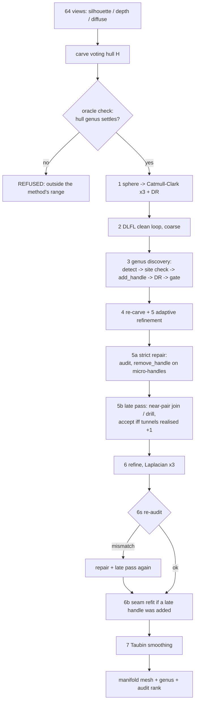

# Topo-Carving — algorithm, architecture, known problems

State: golden v6.5 + oracle check (2026-10-04). This file is the single description of what the pipeline does
today. History and the reasons behind each rule are in the LESSONS files; measured numbers are in
`results64v/GOLDEN.md`.

## 1. Problem and idea

Input: N calibrated views of one object (synthetic benchmark: 64 views, 256 x 256; silhouette + depth + diffuse
shading). Output: a closed, orientable 2-manifold triangle mesh whose **genus is discovered from the images**.

Differentiable rendering (DR) moves vertices; it cannot change topology. So topology is changed only by explicit
operators of the TopMod DLFL system (`add_handle`, `remove_handle`), each of which leaves a valid 2-manifold, and
each change must be justified by evidence:

- **the oracle** — a visual hull carved from the silhouettes. `x not in hull` is hard evidence of air. Its genus
  g\* is the number of tunnels; its tunnels say where they are;
- **the site check** — what lies between the two faces a handle would connect (winding number of our own mesh +
  exact silhouette test), deciding *drill a membrane* vs *join two parts* vs *do nothing*;
- **the audit** — linking numbers between the mesh's handle loops and closed curves through the hull's tunnels:
  does the surface *realise* every tunnel, or does it merely have the right genus?

## 2. Notation

| symbol | meaning |
|---|---|
| Ω | the true solid (unknown) |
| H | visual hull, Ω ⊆ H. Voting hull: a voxel is carved if ≥ 2 views see background |
| M | solid bounded by our mesh |
| g\* | genus of H after closing/opening (radii 1, 2, 3; mode) |
| membrane | mesh material in hull air that seals a tunnel |
| w(x) | generalised winding number of the mesh at x: 0 outside, 1 inside, 2 where two parts interpenetrate, −1 in a pocket whose two pages passed through each other |
| air loop A_k | closed curve in hull air through tunnel k (one per independent tunnel) |

## 3. Pipeline (`golden_chain.sh`)



| stage | script | what happens | TopMod operators |
|---|---|---|---|
| 0 oracle check | `oracle_check.py` | hull genus for closing radii 1..6 must show a plateau of three equal values equal to g\*; otherwise the run is refused | — |
| 1 init | `run_64v.py` (STOP_AFTER=cc3) | icosphere, three Catmull-Clark levels, DR between levels | `make_icosahedron`, `catmull_clark` |
| 2 clean | `phase4_inloop.py` | 400 DR steps with flips and link-condition-guarded collapses | `flip`, `collapse_edge_tri` |
| 3 genus discovery | `phase7_multi.sh` → `phase7_handle.py` | one handle per round: detect a candidate, site check, `add_handle`, 400 DR steps, gate; reverted if rejected; stops at genus = g\* or when no evidence is left | `insert_edge` / `delete_edge` (merge a membrane into one rim polygon), `subdivide_edge`, **`add_handle`** |
| 4 re-carve | `run_64v.py` (RESUME) | subdivide + DR on the new topology | `catmull_clark` |
| 5 refine | `phase4_inloop.py` | adaptive remeshing schedule (Palfinger-style velocity criterion), up to ~50k vertices | `subdivide_edge`, `collapse_edge_tri`, `flip` |
| 5a strict repair | `strict_repair.py` | audit; while genus > tunnels realised: remove a handle that links no tunnel | **`remove_handle`** (`delete_edge` + `stellate`) |
| 5b late pass | `phase7_multi.sh` (strict env) | near-pair detector → linking-vector prefilter → `add_handle` → DR → accept iff tunnels realised +1 | **`add_handle`** |
| 6 refine | `phase4_inloop.py` | Laplacian weight x3 | as stage 5 |
| 6s re-audit | `linking_audit.py`, 5a, 5b | the refine can collapse a handle; re-audit and repair if needed | as 5a / 5b |
| 6b seam refit | `phase4_inloop.py` | 500 DR steps, flips on, collapses off — only if a handle was added late | `flip` |
| 7 smoothing | `phase5_taubin.py` | Taubin, vertex positions only | — |

Supervision in every DR stage: silhouette L1 + masked depth L1 + headlight-diffuse L1, nvdiffrast, 64 views.

## 4. Stage 3 in detail: propose and verify one handle

**Detectors** (in this order; the first that returns a candidate wins):

1. *membrane* (`membrane_locate.py`): faces whose interior samples lie > 2 voxels outside the hull, grouped into
   patches; pairs of patches on the same voxel block of "mesh material in hull air" whose removal opens a cycle.
2. *hull-guided completion* (`hull_locate.py`): closing-ladder plugs of the hull give tunnel locations; a face pair
   is found along the plug's centreline. Slow (10–20 min per query); only reached when (1) finds nothing.
3. *rays*, then *contact join* (non-adjacent faces with opposed normals within 1.5 voxels).

**Site check** (`membrane_check`, `site_kind_full`), on 7 points of the segment between the two face centroids:

| inside = share with \|w\| ≥ 0.5 | air = share outside the hull (≥ 2 of 64 silhouettes at 1024 px see background) | decision |
|---|---|---|
| ≥ 0.6 | ≥ 0.6 | **MEMBRANE** → drill |
| ≤ 0.4, or overlap (\|w\| ≥ 1.5) ≥ 0.6 | ≤ 0.4 | **CONTACT** → join, if geodesic / straight distance ≥ 50; otherwise CREASE (same sheet folded) |
| anything else | | INVALID |

**Gate** (`jev_handle_gate.py`, count backend) after the handle and 400 DR steps: accept iff the held-out
silhouette score rose (≥ 0.002) or the spike count fell (≤ 0.9x), or — when genus < g\* — the site was MEMBRANE /
CONTACT. A rejected handle is reverted and its position is remembered (no detector proposes within 0.3 of it).

## 5. The audit (`linking_audit.py`)

Genus is a count. The audit asks whether the surface realises each tunnel of the hull.

1. **Air loops.** Marching-cubes surface of the hull → its 2g H1 generators (tree–cotree) → each loop is pushed off
   the surface up the distance-to-solid field and re-routed through the air (cost 1/distance). g of them thread a
   tunnel, g become contractible; the threading, linearly independent ones are kept by linking them with the hull's
   own loops. Their number must equal the hull genus. Ground-truth-free, shape-agnostic.
2. **Linking matrix.** Gauss linking number (exact, solid-angle form per segment pair) of each of the mesh's 2g
   generator loops with each air loop. **rank = number of hull tunnels the surface realises.**
   Correct: rank = genus = g\*. A redundant or hidden handle: genus > rank.
3. **Candidate handle** between faces f_i, f_j: the loop *segment + surface geodesic path*. Its linking vector must
   be independent of the rows already present (it encloses a tunnel not realised yet). Used only on the refined
   mesh: on the coarse mesh the air loops still pass through unopened membranes and the vectors are polluted.
4. **Crossings** (`loop_crossings`): cast the air loops through the mesh. A sealed tunnel's loop crosses the
   surface exactly twice, an open one never. Works on the coarse mesh.

What it found: v6.4 had the right genus in 27/27 runs, but on fertility only 6/21 surfaces realised all four
tunnels. In the others one tunnel was open only because two parts interpenetrate (w = 2, never joined), and the
fourth handle was a **micro-handle**: a triangle-sized tube that links nothing.

## 6. Strict repair (stages 5a, 5b, 6s)

- **5a `remove_handle`.** A micro-handle is a *non-face 3-cycle* (three existing edges whose triangle is not a
  face), non-separating, with zero linking vector. On one side of this neck the faces touching it form a band; all
  band edges leaving a neck vertex are removed with `delete_edge`. Every deletion but one merges two faces; exactly
  one finds the same face on both sides and splits it — that is the genus −1 step. The neck triangle caps one side,
  `stellate` closes the other. Manifold after every step.
- **5b late pass.** Near-pair detector: KD-tree face pairs within 6 voxels, opposed normals, non-adjacent,
  clustered; pairs whose midpoint has |w| ≥ 1.5 are tried first. A *drill* needs a MEMBRANE site; a *join* needs no
  hull air between the faces. Either needs an independent linking vector. After `add_handle` + 400 DR steps the
  handle is kept iff the rank rose by exactly one. No hull face-pair search here.
- **6s.** The Stage-6 refine can shrink a small join tube back to a micro-handle (seen once: 4/4 → 2/4, geometry
  damaged). Re-audit; on a mismatch run 5a + 5b again, then the 6b refit.

## 7. Architecture

```
topmod/                          pure-Python DLFL library (30 operators)
  dlfl.py  operators.py            half-edge structure; insert_edge / delete_edge / create_vertex / delete_vertex
  high_level_ops.py                add_handle, remove_handle, collapse_edge_tri, stellate, subdivide_edge, ...
  subdivision.py  remeshing.py     Catmull-Clark and the other schemes
  cpp/  core_backend.py            C++ kernel for the hot loops
experiments/opseq_v5/despike/
  golden_chain.sh                  the chain (stages, skip-if-exists resume, [RESULT] / [STRICT] lines)
  run_64v.py                       cameras, GT renders, stages 1 and 4
  phase4_inloop.py                 DR loop with DLFL remeshing (stages 2, 5, 6, 6b)
  phase7_multi.sh                  round driver: detect -> handle -> DR -> gate -> accept / revert
  phase7_handle.py                 detectors, site check, add_handle execution, guards
  membrane_locate.py  hull_locate.py   membrane detector; closing-ladder plugs
  hull_field.py                    voting hull, distance field, hull genus
  jev_handle_gate.py               accept / reject rule
  linking_audit.py                 air loops, linking numbers, rank, crossings
  strict_repair.py                 micro-handle removal via remove_handle
  oracle_check.py                  refuse shapes whose hull genus does not settle
  eval_cd_iou.py                   Chamfer distance + volume IoU after ICP
  results_genus/                   final meshes (.npz), audit tables, figures, GIFs
  results64v/GOLDEN.md             version log with all measured numbers
  LESSONS_*.md                     why each rule exists; negative results
experiments/opseq_v5/shapes_ext/   external benchmark models (sources in README.md; files not committed)
```

Switches (all environment variables): `STRICT` (default 1 for synthetic shapes), `ORACLE_CHECK` (1),
`SHAPE_DIR`, `S3_ROUNDS` / `S5_ROUNDS`, `GT_MODE` (give g\* instead of reading it from the hull), and the
experimental, default-off `AIR_GUARD`, `BATCH_OPEN`, `NEAR_PAIRS`, `GATE_DHO_ONLY`.

## 8. Results (golden v6.5, RTX 5090, GPU not shared)

| shape | genus | genus right | all tunnels realised | VolIoU | wall |
|---|---|---|---|---|---|
| armadillo | 0 | 6/6 | 6/6 | 0.995 | 4.1–4.8 min |
| kitten | 1 | 6/6 | 6/6 | 0.998 | 4.3–5.0 min |
| rockerarm | 1 | 6/6 | 6/6 | 0.987 | 4.3–5.7 min |
| threeholes | 3 | 6/6 | 6/6 | 0.991 | 5.2–5.7 min |
| fertility | 4 | 16/16 | 16/16 | 0.988–0.992 | 5.6–8.7 min |
| botijo | 5 | 3/3 | 3/3 | 0.996–0.998 | 7.7–9.6 min |
| heptoroid | 22 | refused by the oracle check (forced: collapses) | — | — | — |

## 9. Known problems and limits

1. **Thin-walled shapes (heptoroid).** The visual hull fills every concavity no silhouette can see: 1.9x the
   object's volume, genus 40 / 31 / 44 over closing radii (true: 22). Voxel resolution does not help (256³ → 512³:
   no change); unbiased silhouette edges and 1-vote carving reduce the excess to 1.26x but the genus still does not
   settle. Giving the true genus does not help either — the *locations* come from the hull. Needs a different
   evidence source (carving with depth). Detected up front by the oracle check.
2. **Fake handles are repaired, not prevented.** About half of the fertility runs still create a micro-handle in
   Stage 3 (hole in a free-standing fin; drill when every tunnel is already open; second drill in one tunnel).
   `AIR_GUARD` stops the first two kinds, not the third.
3. **A tunnel opened by interpenetration needs a late join.** DR lets two parts pass through each other; the join
   is only reliable on the refined mesh. Costs fertility about 2.5 min per affected run.
4. **Self-intersections are not prevented** (about 1 % of faces); the manifold guarantee is combinatorial.
5. **A redundant handle that is not a 3-cycle cannot be removed** (seen once); the final audit reports it.
6. **Hull-guided completion is slow** (10–20 min per query). The strict late pass avoids it; Stage 3 can still
   reach it.
7. **Real captures**: the audit uses a hull grid defined by the GT bounding box, so `STRICT` and the oracle check
   are off for `REAL_DATA`. Not validated on real video yet.
8. **Competitor numbers are not reproducible**: the papers we compare with define neither Chamfer distance nor
   volume IoU and released no code; all baselines are re-measured with `eval_cd_iou.py`.
9. Seam lines on thin arms (cosmetic); resolution ceiling around 50–60k faces at 256² supervision.
