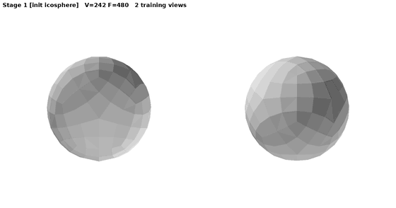
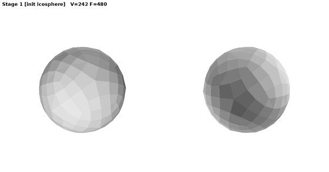
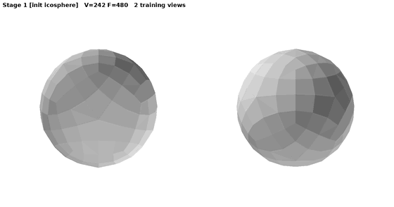
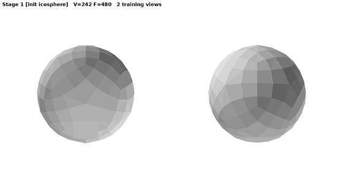
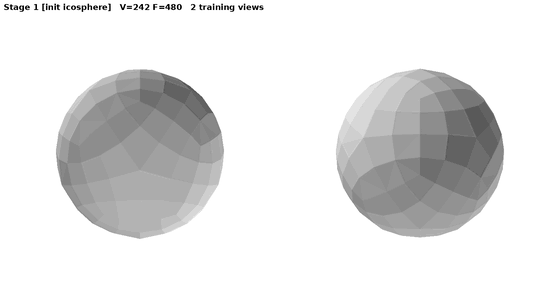
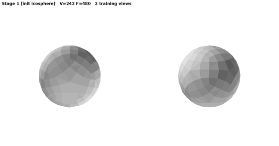

# Topo-Carving evolution GIFs — gallery

Every GIF/MP4 here is a frame-by-frame recording of one chain run (`SNAPSHOT_EVERY=2` in `golden_chain.sh`): flat-shaded
renders of the mesh after every other optimisation step, all stages concatenated, the title bar giving the stage, the
step, V/F and (from v6 on) the genus. Three series were recorded as the pipeline evolved:

| series | date | chain version | view | what you see |
|---|---|---|---|---|
| `*_golden_v3_discord.gif` | 2026-09-09 | v3/v5 chain, midpoint subdivision, **no genus discovery** | 8×8 mosaic of all 64 training cameras | the sphere carving itself into the shape; genus stays 0 |
| `*_golden_v3_cc_discord.gif` (+ `_cc.mp4`, `_cc_small.gif`) | 2026-09-10..12 | same chain with TopMod Catmull-Clark refinement (`C2F_SUBDIV=cc`) | 64-camera mosaic | same, with the CC levels visible in the title |
| `*_gifhd_discord.gif` / `*_gifhd.mp4` | 2026-09-27 | golden v6.3 (genus discovery + late pass) | 2 hero views ~90° apart, 760 px (`SNAPSHOT_HERO=1`) | each `add_handle` opening a tunnel; genus 0 → g\* in the title |
| `*_gifhd2_discord.gif` / `*_gifhd2.mp4` | 2026-09-27 | same run, second cut (denser frames) | 2 hero views | — |
| `*_evolution_hd.gif` / `.mp4` | 2026-09-27 (botijo 2026-10-03) | golden v6.3/v6.5 — **the cut used in the README** | 2 hero views, 1080p MP4 | sphere → correct genus, stage and genus tracked in the title bar |

Files without `_discord` in the name are the full-size masters (up to 150 MB) and are not in git; the `_discord`
cuts (≤ 16 MB, palette-reduced, every 5th frame) and the `_evolution_hd` cuts are tracked.

## Final cut (golden v6.5 chain): sphere → discovered genus

| | |
|:--:|:--:|
|  |  |
| fertility — genus **4** (3 drills at the coarse stage, 1 late) | botijo — genus **5** (3 drills, 2 joins on the refined mesh) |
|  |  |
| threeholes — genus **3** | kitten — genus **1** |
|  |  |
| rockerarm — genus **1** | armadillo — genus **0**, no false tunnel |

1080p: `*_evolution_hd.mp4`.

## Hero-view cuts, golden v6.3 (2026-09-27)

| | |
|:--:|:--:|
|  |  |
| fertility, cut 1 | fertility, cut 2 (denser) |
|  |  |
| threeholes | kitten |
|  |  |
| rockerarm | armadillo |

## 64-camera mosaics, golden v3 / v5 chain (2026-09-09..12, before genus discovery)

| | |
|:--:|:--:|
|  |  |
| fertility, CC chain (genus stays 0 — this is what motivated genus discovery) | armadillo, CC chain |
|  |  |
| fertility, midpoint chain | kitten, midpoint chain |
|  |  |
| rockerarm, midpoint chain | armadillo, midpoint chain |

How to record a new one: `SNAPSHOT_EVERY=2 SNAPSHOT_HERO=1 SHAPES=<shape> TAGP=<tag> bash despike/golden_chain.sh`
(frames in `out_liou/frames_<tag>_<shape>/`, MP4/GIF written to this directory at the end of the chain).
